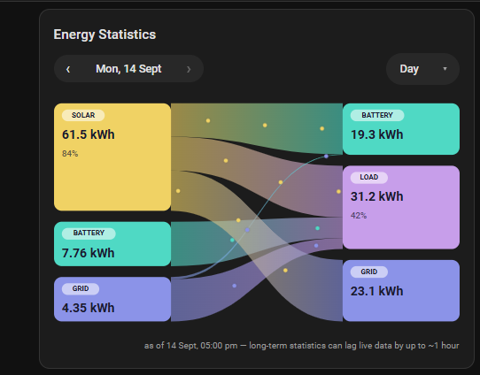

# Sigenergy Energy Flow Card

A Home Assistant Lovelace card that recreates the **mySigen** app's colour-coded
energy flow graph — Solar / Battery / Grid as sources on the left, Battery /
Load / Grid as destinations on the right — with a **Day / Week / Month / Year**
period selector, built for Sigenergy ESS systems.


*(screenshot coming soon — see [Contributing](#contributing))*

## Why

The Home Assistant integrations for Sigenergy ESS systems expose plenty of raw
sensors, but nothing that reproduces the at-a-glance energy flow picture the
mySigen phone app shows. This card builds that picture directly in your
dashboard: no phone app required, full history (not just live), and it's
yours to theme and share.

## Features

- Solar / Battery / Grid sources on the left, Battery / Load / Grid
  destinations on the right, battery shown on both sides since it's the one
  node that's both a source and a destination — same layout as mySigen.
- Its own **Day / Week / Month / Year** period selector with `‹ ›` navigation,
  built into the card (no need to have the Energy Dashboard configured).
- Animated flow ribbons, sized by kWh, with speed reflecting relative flow size.
- Works entirely off Home Assistant's long-term statistics — no extra
  integration or template sensors required, as long as your Sigenergy
  integration's daily energy sensors are recorded (the default).
- Configurable entity mapping, so it works with whichever Sigenergy
  integration you're on (Sigenergy Local Modbus, sigenergy2mqtt, etc.) —
  point it at your own entity_ids via the visual editor or YAML.

## Important: this is an estimate, not a meter reading

**No Sigenergy integration (or inverter brand, or the mySigen app itself, as
far as we've been able to tell) meters the individual sub-flows directly** —
there's no sensor for "solar that went straight to the battery" vs "solar
that went to load" vs "solar that got exported." What every Sigenergy
integration *does* expose is a handful of totals: solar produced, battery
charged, battery discharged, grid imported, grid exported, and (sometimes)
load consumed.

This card allocates those totals across the individual ribbons using the same
priority order Home Assistant's own core Energy Distribution card uses:

1. Solar covers load first
2. Whatever solar is left over charges the battery
3. Whatever solar is still left over exports to the grid
4. Battery discharge covers any load solar didn't
5. Grid import covers any load neither solar nor battery covered
6. Grid import charges the battery (rare — only shows up if grid-charging is
   enabled and the numbers don't reconcile otherwise)

To keep this accurate over a whole day/week/month (not just an instant), the
card fetches statistics at a fine bucket size (hourly within a day, daily
within a week/month, monthly within a year) and runs this allocation
*per bucket*, then sums the results — a whole day's *totals* fed through this
model as a single lump would incorrectly cancel out, e.g., a battery that
charged in the morning and discharged in the evening of the same day. See
[`src/flow-model.ts`](src/flow-model.ts) for the full explanation and
[`test/flow-model.test.ts`](test/flow-model.test.ts) for a worked example
using real exported data.

If you have entities that directly meter a sub-flow, wire them in — the
allocation model is only a fallback for the ribbons you don't have direct
sensors for.

## Installation

### HACS (custom repository, until this is accepted into the default store)

1. HACS → the "⋮" menu (top right) → **Custom repositories**
2. Repository: `https://github.com/kjmcfall/sigen-flow-card`, Category: **Dashboard**
3. Install "Sigenergy Energy Flow Card", then reload your browser.

### Manual

1. Download `dist/sigen-flow-card.js` from the
   [latest release](https://github.com/kjmcfall/sigen-flow-card/releases).
2. Copy it to `<config>/www/sigen-flow-card.js`.
3. Add it as a dashboard resource: **Settings → Dashboards → ⋮ → Resources**,
   URL `/local/sigen-flow-card.js`, type **JavaScript Module**.

## Finding your entities

The six entities this card needs are **daily energy sensors** (kWh), not the
instantaneous power (W) sensors. On the Sigenergy Local Modbus integration
these live on the plant/"storage" device and are named things like:

| What | Example entity | Notes |
|---|---|---|
| Solar | `sensor.<your_device>_storage_daily_pv_energy` | required |
| Battery charge | `sensor.<your_device>_storage_daily_battery_charge_energy` | required |
| Battery discharge | `sensor.<your_device>_storage_daily_battery_discharge_energy` | required |
| Grid import | `sensor.<your_device>_storage_daily_grid_import_energy` | required |
| Grid export | `sensor.<your_device>_storage_daily_grid_export_energy` | required |
| Load / consumption | `sensor.<your_device>_storage_daily_load_consumption` | optional — derived from the five above if omitted |
| Battery SoC | `sensor.<your_device>_storage_battery_state_of_charge` | optional, display only |

`<your_device>` is whatever name you (or the integration) gave your
Sigenergy system — it's not fixed, so use the entity picker in the card's
visual editor, or check **Developer Tools → Statistics** to find your exact
entity_ids and confirm they have long-term statistics recorded (this card
can't use an entity that doesn't show up there).

If you're on a different Sigenergy integration (sigenergy2mqtt, the cloud-API
based `sigenergy-ha`, etc.), the entity *names* will differ, but the same six
kinds of totals should exist somewhere in your setup — point the card at
whichever entities hold them.

## Configuration

```yaml
type: custom:sigen-flow-card
title: Energy Flow # optional
default_period: day # day | week | month | year
week_start: 1 # 0 = Sunday, 1 = Monday
entities:
  solar_energy: sensor.your_daily_pv_energy
  battery_charge_energy: sensor.your_daily_battery_charge_energy
  battery_discharge_energy: sensor.your_daily_battery_discharge_energy
  grid_import_energy: sensor.your_daily_grid_import_energy
  grid_export_energy: sensor.your_daily_grid_export_energy
  load_energy: sensor.your_daily_load_consumption # optional
  battery_soc: sensor.your_battery_soc # optional
colors: # optional -- defaults are mySigen-inspired
  solar: "#F5B400"
  battery: "#4FC3F7"
  grid: "#1A56C4"
  load: "#8E5FD6"
show_updated: true # optional, defaults to true
```

See [`examples/dashboard-example.yaml`](examples/dashboard-example.yaml) for a
complete, commented example.

| Option | Type | Default | Description |
|---|---|---|---|
| `entities` | object | — | required. See above. |
| `title` | string | none | optional card title |
| `default_period` | `day`\|`week`\|`month`\|`year` | `day` | period shown on first load |
| `week_start` | `0`\|`1` | `1` | which day the Week view starts on |
| `colors` | object | mySigen palette | override any of `solar`/`battery`/`grid`/`load` |
| `show_updated` | boolean | `true` | show the small "as of HH:MM" freshness note |

## A note on data freshness

Home Assistant's long-term statistics are computed on a rolling basis and can
lag live sensor data by up to about an hour. The card shows a small "as of"
note for exactly this reason — don't be alarmed if today's numbers look a
little behind what your inverter is showing live right now.

## Development

```bash
npm install
npm run build   # bundles src/ -> dist/sigen-flow-card.js
npm test        # runs the unit tests (flow allocation + layout math)
npm run watch   # rebuilds on save
```

The project is plain TypeScript + [Lit](https://lit.dev), bundled with
Rollup. There's no framework magic beyond that — `src/flow-model.ts` and
`src/sankey-layout.ts` are pure, dependency-free functions that are unit
tested directly; `src/sigen-flow-card.ts` is the actual custom element.

## Contributing

Issues and PRs welcome — especially:

- A real mySigen app screenshot so the default palette and layout can be
  checked against the real thing (this card was built from written
  descriptions of the app rather than a live screenshot).
- Reports of which Sigenergy integrations/entity-naming schemes you're using,
  so the docs above can cover more of them.
- If your setup exposes genuine sub-flow sensors (not just the six totals),
  please share the entity names — the allocation model can be bypassed
  wherever real data exists.

## Credits

Built by [@kjmcfall](https://github.com/kjmcfall), with the initial
implementation (data model, allocation algorithm, layout math, and card code)
drafted by Claude (Anthropic).

## License

[MIT](LICENSE)
